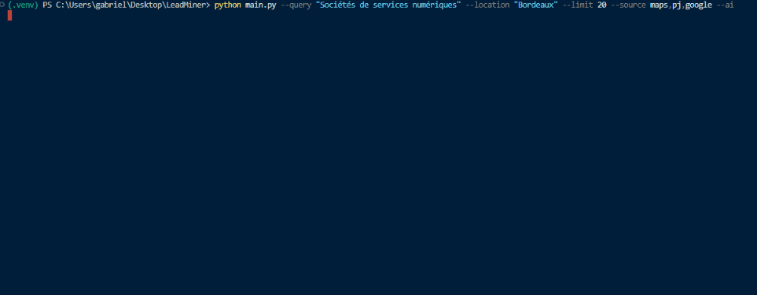

# LeadMiner

[](https://github.com/vexato/LeadMiner/actions)
[](https://www.python.org/downloads/)
[](https://github.com/vexato/LeadMiner/releases)
[](https://github.com/vexato/LeadMiner/blob/main/LICENSE)

Language: EN | [FR](docs/README.fr.md)

LeadMiner is a Python CLI tool for multi-source B2B lead generation.
It discovers companies, deduplicates records, enriches data from company websites, assigns a quality score, and exports results to JSON and CSV.

## Table of Contents

- [Features](#features)
- [Pipeline](#pipeline)
- [Requirements](#requirements)
- [Installation](#installation)
- [Quick Start](#quick-start)
- [CLI Options](#cli-options)
- [AI Filter (Optional)](#ai-filter-optional)
- [Quality Score](#quality-score)
- [Exported Fields](#exported-fields)
- [Output Naming](#output-naming)
- [Useful Examples](#useful-examples)
- [Project Structure](#project-structure)
- [Troubleshooting](#troubleshooting)
- [Legal Best Practices](#legal-best-practices)
- [License](#license)

## Features

- Multi-source discovery: maps, pj, google
- Record deduplication (name + domain)
- Website enrichment (email, contact page, description)
- Lead quality scoring
- Filters by required fields and minimum score
- Export to JSON, CSV, or both
- Optional final AI filter (Groq)

## Preview (real duration: 9 min)




## Pipeline

```text
1) Discovery (sources: maps, pj, google)
2) Source tagging
3) Deduplication + field merge
4) Website enrichment (async/concurrent)
5) Quality scoring
6) Filters (junk, empty, --only, --min-score)
7) Sort by score (descending)
8) Optional AI filtering (--ai, Groq)
9) JSON/CSV export
```

## Requirements

- Python 3.11+
- Playwright Chromium

## Installation

```bash
pip install -r requirements.txt
playwright install chromium
```

## Quick Start

```bash
python main.py -q "web agency" -l "Bordeaux"
```

Default behavior:

- source = maps
- limit = 20 companies per source
- format = both (JSON + CSV)
- output directory = results/

Important: --limit is applied per source. With maps,pj,google, the raw volume can exceed the limit before deduplication and filtering.

## CLI Options

### Required

| Option | Short | Description |
|---|---|---|
| --query | -q | Search activity (example: web agency) |
| --location | -l | City/area (example: Bordeaux) |

### Sources, volume, output

| Option | Default | Description |
|---|---|---|
| --source (-s) | maps | Comma-separated sources: maps, pj, google |
| --limit (-n) | 20 | Max companies per source |
| --format (-f) | both | json, csv, or both |
| --output-dir (-o) | results | Export directory |

### Quality filtering

| Option | Default | Description |
|---|---|---|
| --only | none | Keep companies with ALL requested fields (email, contact, website, address, description) |
| --min-score | 0 | Keep companies with score >= N |
| --no-filter | off | Disable junk and empty-record filtering |

Examples for --only:

```bash
--only email
--only email,contact
--only email,website,description
```

### Scraping behavior

| Option | Default | Description |
|---|---|---|
| --scroll-count | 6 | Number of Google Maps scroll iterations |
| --concurrency | 5 | Number of parallel website scrapers |
| --no-headless | off | Show browser window (debug/CAPTCHA) |
| --verbose (-v) | off | Enable debug logs |

## AI Filter (Optional)

| Option | Default | Description |
|---|---|---|
| --ai | off | Final relevance filtering via Groq. Also exports refused companies into *_refused.* files |

Create a .env file at the project root:

```bash
GROQ_API_KEY=your_api_key_here
```

Then run:

```bash
python main.py -q "web agency" -l "Bordeaux" --ai
```

## Quality Score

Score is calculated with a maximum of 11 points:

- +2 website present
- +2 address present
- +1 contact page present
- +1 description present
- +3 professional email
- -2 free-provider email (gmail, outlook, etc.)
- +2 company found in multiple sources

Results are sorted by descending score.

## Exported Fields

| Field | Description |
|---|---|
| company_name | Company name |
| website | Website URL |
| email | Detected email |
| description | Short description |
| contact_page | Detected contact page URL |
| address | Postal address |
| sources | Origin sources (maps, pj, google) |
| score | Final quality score |

## Output Naming

Exports are written to results/ (or --output-dir) with names like:

```text
<sources>_<query>_<location>_<timestamp>.json
<sources>_<query>_<location>_<timestamp>.csv
```

If --ai is enabled, extra files are generated for refused companies:

```text
..._refused.json
..._refused.csv
```

## Useful Examples

```bash
# Basic (Google Maps)
python main.py -q "web agency" -l "Bordeaux"

# Multi-source + CSV only
python main.py -q "digital agency" -l "Paris" -s maps,pj,google -n 30 -f csv

# Leads with email + contact page
python main.py -q "web development" -l "Lyon" --only email,contact

# Higher quality leads only
python main.py -q "it services" -l "Toulouse" -s maps,pj,google --min-score 5

# Visible browser debug
python main.py -q "seo agency" -l "Nantes" --no-headless --verbose
```

## Project Structure

```text
.
├── main.py
├── requirements.txt
├── config/
│   └── settings.py
├── core/
│   ├── orchestrator.py
│   └── pipeline.py
├── scrapers/
│   ├── base.py
│   ├── registry.py
│   ├── google_maps_scraper.py
│   ├── pages_jaunes_scraper.py
│   ├── google_search_scraper.py
│   └── website_scraper.py
├── extractors/
│   ├── email_extractor.py
│   └── text_extractor.py
├── models/
│   └── company.py
├── utils/
│   ├── deduplicator.py
│   ├── filter.py
│   ├── filters.py
│   ├── scorer.py
│   ├── ai_filter.py
│   └── ...
└── output/
    └── exporter.py
```

## Troubleshooting

### Too few results

- Increase --limit
- Enable multiple sources with -s maps,pj,google
- Use --no-headless to inspect pages visually

### No emails found

This is common: many websites do not expose direct email addresses.

Tips:

- Use --only contact to keep companies with a contact page
- Combine multiple sources to get more websites

### Playwright or browser errors

Reinstall Chromium:

```bash
playwright install chromium
```

### CAPTCHA or blocking

- Re-run with --no-headless
- Reduce --concurrency
- Increase delays in config/settings.py

## Legal Best Practices

- Respect target websites Terms of Service.
- Respect local regulations (scraping, data privacy, outreach).
- Maintain selectors over time because HTML structures change frequently.

## License

This project is licensed under the MIT License. See [LICENSE](LICENSE).
